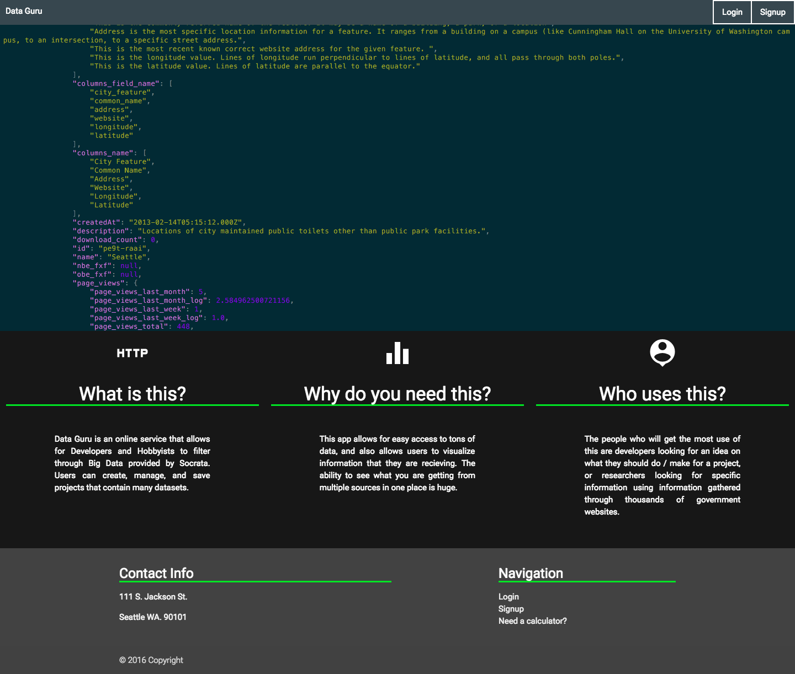
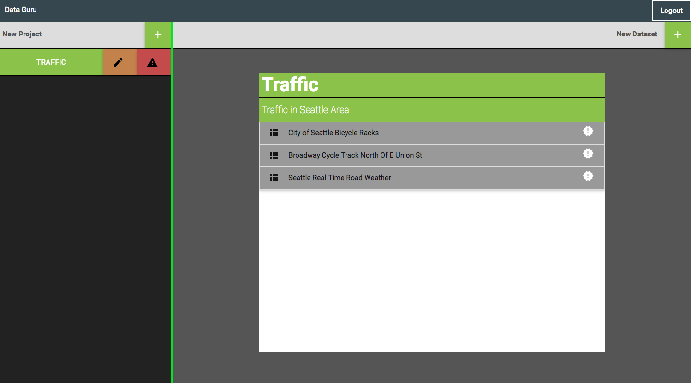
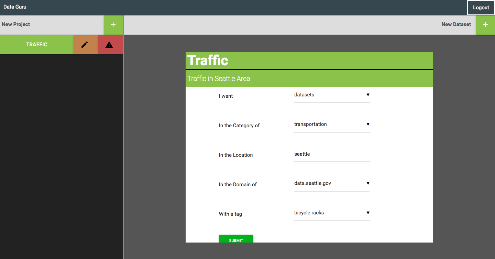

# [Data-Guru](https://data-guru.herokuapp.com/)

Data Guru provides an interface for filtering through Socrata's API, and adding
various government related or public data into a project that interests you.

Sorting through data may be hard at times, and Data Guru allows you to filter and organize relevant
data for your projects.

## Technologies Used

* JQuery
* NodeJS
* ExpressJS
* PostgreSQL

### Please submit any feedback or bugs in Issues! Any feedback is welcome!
